# Passport of `nvidia/nemotron-3.5-lightning:free`

Measurement `pilot_nemotron3_5_lightning_v43`, 4,753 answered points. The method is described in `docs/05-passport-model.md` of the repository.

## The capacities

The zero point of a capacity is a text of 20 words, the start of the answer, the density at the maximum of its law and one rule; every other axis of the capacity is set by its definition.

The capacities are taken at the level 0.5. At it the share of successes over all requests and the success of the median request reach one half at the same logit, zero, whatever the variance of the request shift: a capacity is the load at which the laws bring the logit of the median request to zero, and it does not depend on that variance.

### P_sync: a word of the text stands on its place

| Capacity | q | By the law | By the bins |
|---|---|---|---|
| instruction capacity, rules | 0.5 | none: the law gives no root | at least 32, reserve left 7.53 |
| fatigue capacity, words | 0.5 | 10,848 (9,503–12,384) | - |

The instruction capacity is the number of rules at which the law of the number of rules brings the logit to zero, and next to it the walk along the bins of that axis; by the law it is none when the fall of that law over its bins does not differ from zero. The fatigue capacity is the word at which the full law of the grid at the density going to zero and one rule reaches zero, on a text of the same length: by the curve of the law, as for `H`.

### H: a rule word on its place is replaced correctly

| Capacity | q | By the law | By the bins |
|---|---|---|---|
| instruction capacity, rules | 0.5 | 10.0 (7.9–12.6) | 7.1 |
| fatigue capacity, words | 0.5 | 195 (143–264) | - |

### F: a misfire on a background word on its place

| Capacity | q | By the law | By the bins |
|---|---|---|---|
| instruction capacity, rules | 0.5 | none: the law gives no root | at least 32, reserve left 8.26 |
| fatigue capacity, words | 0.5 | none: the law gives no root | - |

The instruction capacity is the number of rules at the zero point. The fatigue capacity is the number of the last word of a text of the same length at the zero point.

## The standard stress test

The standard stress test describes how a model behaves as the complexity of a task with fixed proportions of the load increases step by step. The complexity increases until the probability of an error on the last word of the text reaches 50%. The density of replacements in the test is `p = 0.5`, and the text has one rule per 50 words: with `m` rules the text has `T = 50·m` words and `D = 2m` distinct words, each of them repeated 25 times. The length of the text and the number of rules increase together, keeping these proportions.

The point of 50% is set by the combined error of the last word of the median request, `E = 1 − P_sync·H = 0.5`, where `P_sync` is the probability that the word keeps its place in the text, and `H` is the conditional probability that the replacement is made correctly on a kept place. False replacements of background words do not enter the definition of the point, but they are measured at the point found.

The influence of each load is set by its price in the logit of the probability of the correct outcome of the last word. The influence keeps its sign: a negative value means that the load lowers the probability of an error of that kind. The three shares of the influence sum to 100; when the total price of the loads is zero or less, the influence is not defined. The mean share of errors over the text is computed over all its words for the median request. Every number has a 95% confidence interval by the delta method; the parameters of the three quantities are taken independent, since the passport has no covariances between its sections.

1. The point of 50%: T = 189 ± 14 words, 3.8 ± 0.3 rules.
2. The combined error at the point: 50%.
3. The structure of the error at the point, per 100 errors: synchronization 24.5 ± 3.2, replacements 75.5 ± 3.2; background over them, per the same 100: 8.8 ± 1.8.
4. Synchronization: errors over the text for the median request 8.8 ± 1.2%; influence per 100 errors of synchronization at the point: length 31.7 ± 4.8, density 68.3 ± 5.5, rules 0.0 ± 2.3.
5. Replacements: errors over the text for the median request 29.9 ± 0.9%; influence per 100 errors of replacements at the point: length 107.2 ± 12.9, density −15.9 ± 14.5, rules 8.7 ± 4.2.
6. Background: errors over the text for the median request 4.1 ± 0.7%; influence per 100 errors of background at the point: length 7.9 ± 2.6, density 101.7 ± 3.6, rules −9.5 ± 2.5.
7. The combined error over the text for the median request: 35.9 ± 0.5%.

## The formula

`P_correct = P_sync · [π · H + (1 − π) · (1 − F)]`. The formula is the way to combine the three quantities: it has no law and no capacity of its own. `π = m/D` is the replacement density.

## P_sync: a word of the text stands on its place

Model VS-PM, request weights by the cube V × P × M. Fit: GLMM with heterogeneous random-intercept variance, that is with the shift of a request whose variance depends on the load; the variance of the request shift `σ² = 6.18`; 4,753 requests, 15,128,220 trials, 5,663,209 failures, 92 parameters; removed bins: none.

The variance of the shift depends on the load: `ln σ_j = z_j·γ`, 24 parameters more than one variance, `2·Δ ln L = 958.2`. `σ²` above is the mean over the requests. A group is taken with the other two axes averaged over the requests.

| Axis | Centre of the group | Share of the requests | σ² |
|---|---|---|---|
| text length, words | 32.14 | 0.03 | 1.72 ± 0.73 |
| text length, words | 74.78 | 0.04 | 1.39 ± 0.50 |
| text length, words | 138.3 | 0.07 | 1.75 ± 0.53 |
| text length, words | 265.6 | 0.10 | 1.71 ± 0.35 |
| text length, words | 501.8 | 0.12 | 3.89 ± 1.12 |
| text length, words | 979.7 | 0.14 | 5.16 ± 0.85 |
| text length, words | 1925 | 0.15 | 9.98 ± 1.38 |
| text length, words | 3749 | 0.15 | 14.42 ± 2.31 |
| text length, words | 7346 | 0.12 | 13.13 ± 2.30 |
| text length, words | 1.427e+04 | 0.08 | 9.17 ± 2.70 |
| density | 0.001311 | 0.04 | 6.02 ± 2.20 |
| density | 0.002676 | 0.08 | 4.14 ± 1.21 |
| density | 0.005578 | 0.06 | 3.42 ± 0.78 |
| density | 0.01081 | 0.10 | 6.00 ± 1.35 |
| density | 0.0209 | 0.07 | 4.18 ± 0.76 |
| density | 0.04125 | 0.10 | 4.82 ± 1.20 |
| density | 0.07959 | 0.11 | 4.36 ± 0.75 |
| density | 0.1528 | 0.12 | 5.34 ± 1.03 |
| density | 0.3073 | 0.16 | 6.47 ± 1.06 |
| density | 0.6038 | 0.12 | 9.83 ± 2.37 |
| density | 1 | 0.05 | 11.70 ± 3.88 |
| number of rules | 1 | 0.23 | 10.27 ± 1.50 |
| number of rules | 2 | 0.15 | 5.54 ± 0.87 |
| number of rules | 3.518 | 0.17 | 5.55 ± 0.83 |
| number of rules | 6.575 | 0.17 | 4.05 ± 0.74 |
| number of rules | 12.96 | 0.15 | 4.13 ± 0.59 |
| number of rules | 25.23 | 0.13 | 4.97 ± 0.89 |

The approximations through the groups, by the residuals in `ln σ²`, serve the eye.

| Axis | Approximation | Parameters | χ² |
|---|---|---|---|
| text length, words | `a + b·log₂ v` | `a = −5.11`, `b = 1.170` | 189.6 over 10 groups |
| density | `a + b·log₂ p` | `a = 6.94`, `b = 0.359` | 50.4 over 11 groups |
| number of rules | `c + A/m` | `c = 3.86`, `A = 5.37` | 13.8 over 6 groups |

The law of the grid: a length slice is a two-asymptote hyperbola, `[(κ·ℓ + λ) + μ − √((κ·ℓ + λ − μ)² + κ²·ω²)]/2` over `ℓ = log₂ s`, with an own level `μ` in every slice and the other parameters shared, in the coding of the fit: `kappa = −1.807 ± 0.368`, `lambda = 23.351 ± 5.746`, `omega = 4.106 ± 0.666`; `χ² = 62.9` over 77 cells; chosen by the smallest `QAIC` among 3 forms. The law of the plateau runs through the levels of the slices.

The law of the plateau is a slanted hyperbola, `μ + (κ/2)·[(log₂(v/20) − log₂(v/20)*) + √((log₂(v/20) − log₂(v/20)*)² + ω²)]`: `mu = 4.68 ± 0.55`, `kappa = −4.04 ± 2.81`, `corner = 8.37 ± 0.89`, `omega = 0.33 ± 1.22`; `χ² = 8.6` over 11 bins; chosen by the smallest `QAIC` among 3 forms.

The law of the density is a slanted hyperbola, `μ + (κ/2)·[(log₂(p/2⁻¹⁰) − log₂(p/2⁻¹⁰)*) + √((log₂(p/2⁻¹⁰) − log₂(p/2⁻¹⁰)*)² + ω²)]`: `mu = 2.85 ± 0.61`, `kappa = −1.52 ± 0.28`, `corner = 6.34 ± 0.51`, `omega = 1.29 ± 0.98`; `χ² = 6.5` over 10 bins; chosen by the smallest `QAIC` among 3 forms.

The law of the number of rules is a line, `a + b·log₂ m`: `a = 0.69 ± 0.31`, `b = −4.4·10⁻⁵ ± 0.08`; `χ² = 3.1` over 5 bins; chosen by the smallest `QAIC` among 3 forms.

The level `α = δ_VS + δ_P + δ_M = 8.21 ± 0.80` is the logit at the density going to zero and one rule, and that density is itself a continuation of the law.

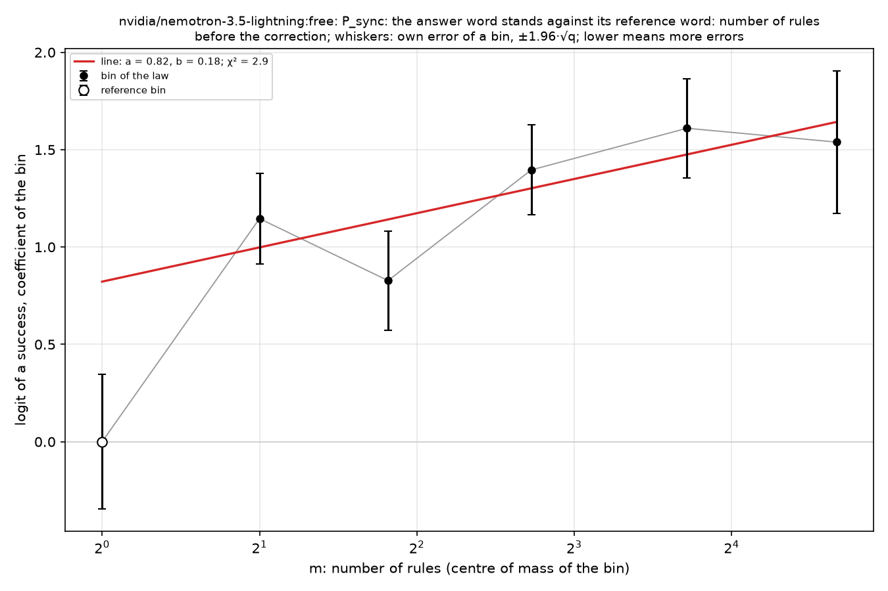

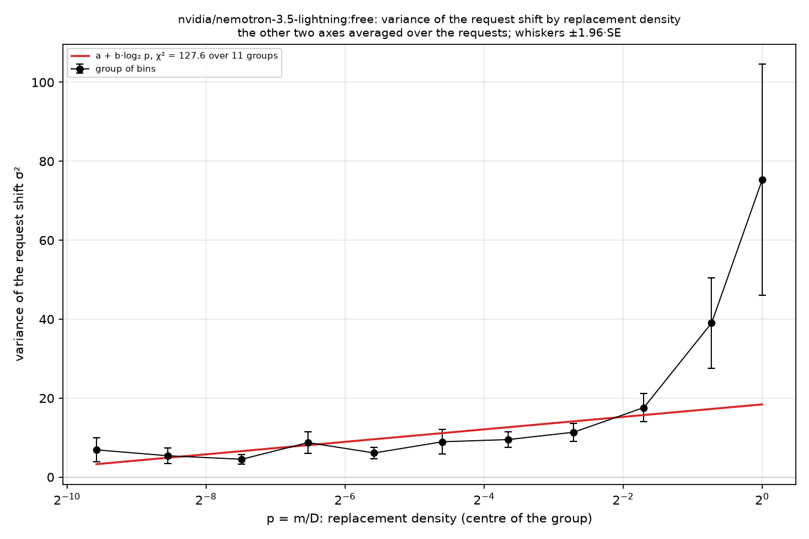

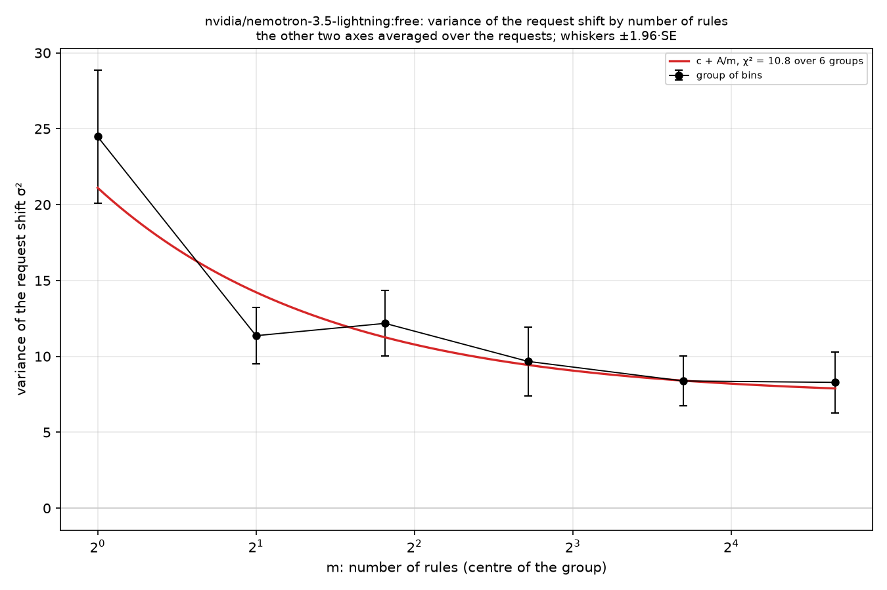

## H: a rule word on its place is replaced correctly

Model VS-PMR, request weights by the cube V × P × M. Fit: with the shift of a request; the variance of the request shift `σ² = 1.38`; 4,680 requests, 590,450 trials, 448,842 failures, 97 parameters; removed bins: none. The variance by the load turned bins against the median request of the data, so the quantity keeps one variance: the variance by the load turns bins against the median request: p_bin_5: passport +0.22, median request -1.22 ± 1.03.

The law of the grid: a length slice is a slanted hyperbola, `μ + (κ/2)·[(ℓ − ℓ*) + √((ℓ − ℓ*)² + ω²)]` over `ℓ = log₂ s`, with an own level `μ` in every slice and the other parameters shared, in the coding of the fit: `kappa = −1.171 ± 0.196`, `corner = 7.453 ± 0.880`, `omega = 4.262 ± 0.784`; `χ² = 106.8` over 77 cells; chosen by the smallest `QAIC` among 3 forms. The law of the levels runs through the levels of the slices.

The law of the levels of the slices is a line, `a + b·log₂(v/20)`: `a = 6.03 ± 0.47`, `b = −0.33 ± 0.04`; `χ² = 6.6` over 11 bins; chosen by the smallest `QAIC` among 3 forms.

The law of the density is a two-slope hyperbola, `μ + β·(log₂(p/2⁻¹⁰) − log₂(p/2⁻¹⁰)*) + (κ/2)·[(log₂(p/2⁻¹⁰) − log₂(p/2⁻¹⁰)*) + √((log₂(p/2⁻¹⁰) − log₂(p/2⁻¹⁰)*)² + ω²)]`: `mu = 0.94 ± 0.40`, `kappa = −0.86 ± 0.19`, `corner = 6.54 ± 0.35`, `omega = 0.68 ± 0.98`, `beta = 0.30 ± 0.10`; `χ² = 4.7` over 10 bins; chosen by the smallest `QAIC` among 4 forms.

The law of the number of rules is a line, `a + b·log₂ m`: `a = −1.28 ± 0.25`, `b = −0.07 ± 0.05`; `χ² = 4.4` over 5 bins; chosen by the smallest `QAIC` among 3 forms.

The law of the rule number is a binary exponential, `μ − A·2^(γ·log₂ r)`: `mu = 0.48 ± 1.22`, `A = 0.56 ± 1.05`, `gamma = 0.32 ± 0.35`; `χ² = 0.2` over 5 bins; chosen by the smallest `QAIC` among 3 forms.

The level `α = μ₀ + μ_P + λ_M + λ_R = 3.66 ± 0.61`.

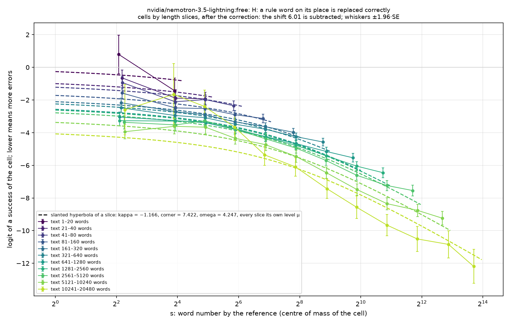

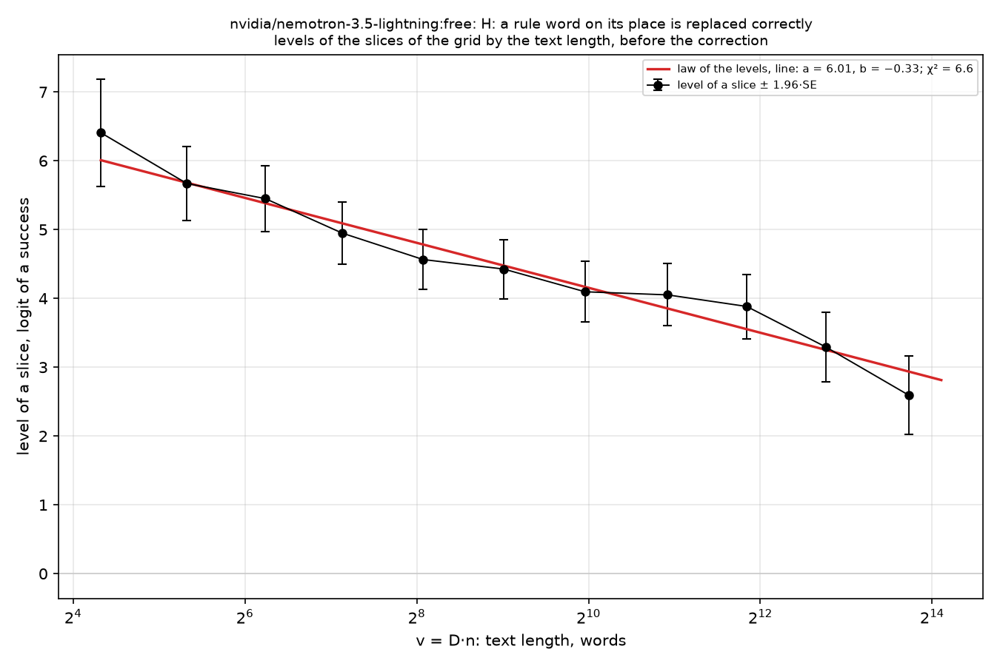

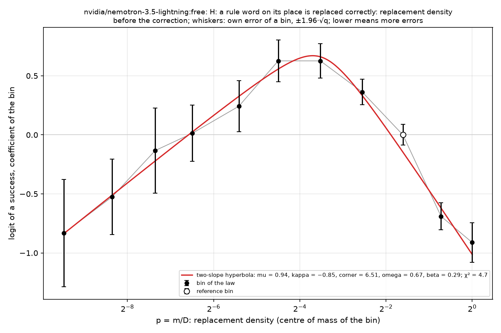

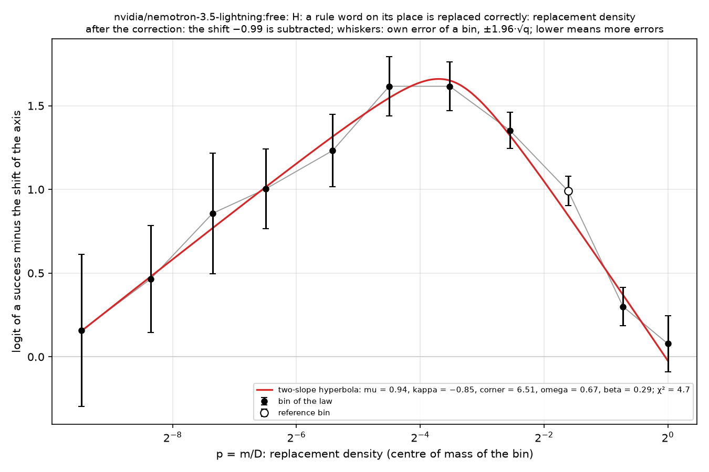

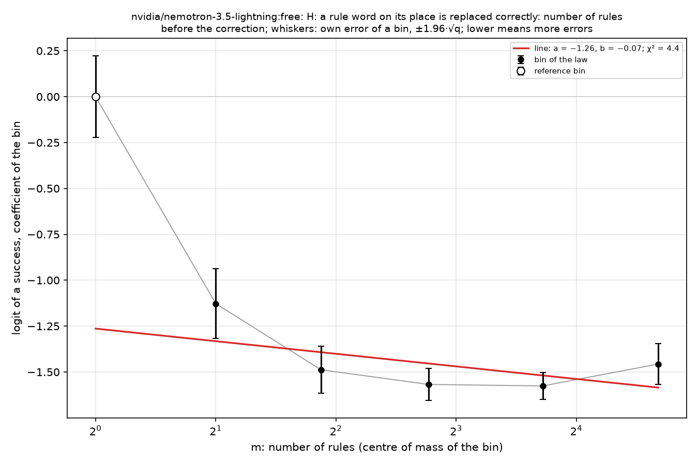

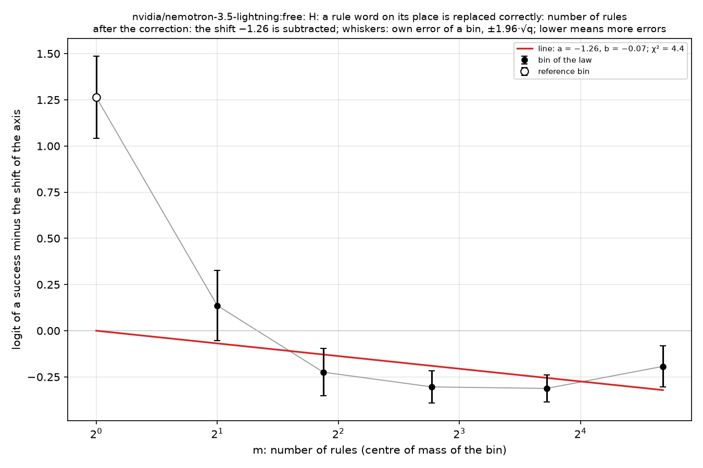

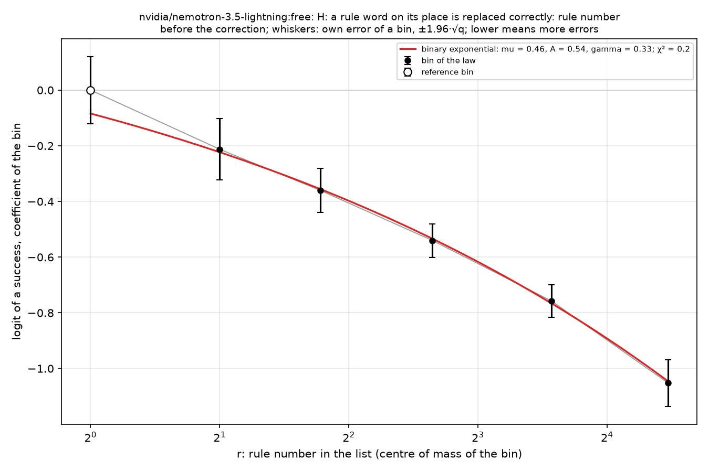

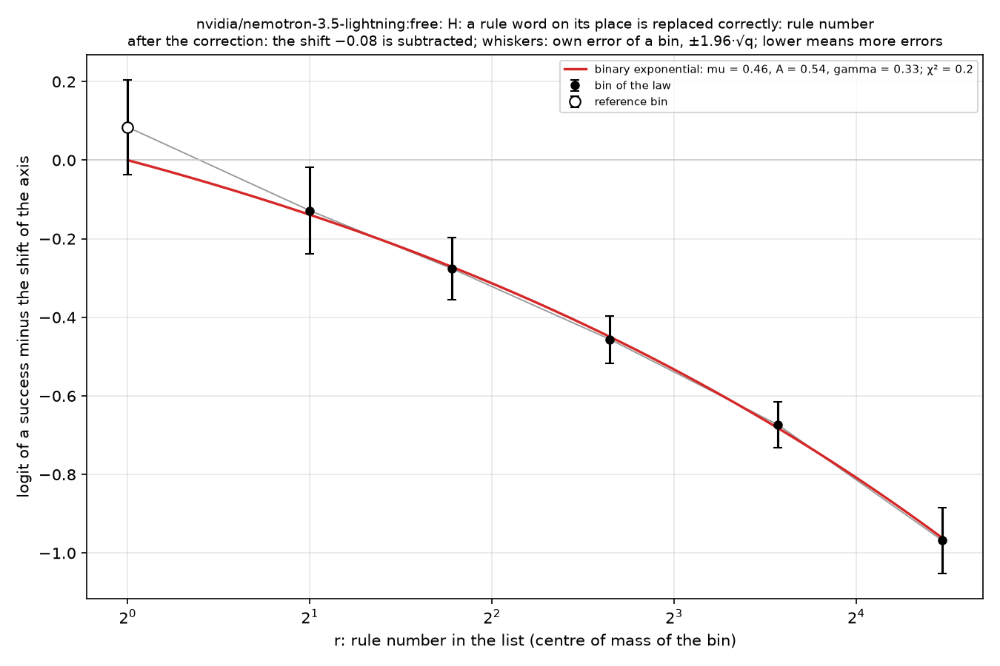

## F: a misfire on a background word on its place

Model V-(s/v)-PM, request weights by the cube V × P × M. Fit: GLMM with heterogeneous random-intercept variance, that is with the shift of a request whose variance depends on the load; the variance of the request shift `σ² = 2.92`; 4,470 requests, 8,874,561 trials, 29,368 failures, 34 parameters; removed bins: none.

The variance of the shift depends on the load: `ln σ_j = z_j·γ`, 23 parameters more than one variance, `2·Δ ln L = 223.4`. `σ²` above is the mean over the requests. A group is taken with the other two axes averaged over the requests.

| Axis | Centre of the group | Share of the requests | σ² |
|---|---|---|---|
| text length, words | 32.78 | 0.02 | 1.50 ± 1.12 |
| text length, words | 75.29 | 0.03 | 1.31 ± 0.59 |
| text length, words | 138.2 | 0.06 | 1.56 ± 0.57 |
| text length, words | 267.3 | 0.10 | 1.48 ± 0.41 |
| text length, words | 505.3 | 0.12 | 1.49 ± 0.31 |
| text length, words | 979.7 | 0.15 | 2.35 ± 0.59 |
| text length, words | 1925 | 0.16 | 2.77 ± 0.54 |
| text length, words | 3747 | 0.16 | 3.91 ± 0.74 |
| text length, words | 7328 | 0.12 | 4.94 ± 1.25 |
| text length, words | 1.416e+04 | 0.08 | 3.63 ± 2.28 |
| density | 0.001314 | 0.04 | 0.28 ± 0.19 |
| density | 0.002701 | 0.08 | 1.07 ± 0.42 |
| density | 0.005578 | 0.06 | 2.04 ± 0.86 |
| density | 0.01081 | 0.11 | 2.78 ± 1.17 |
| density | 0.0209 | 0.07 | 2.47 ± 0.71 |
| density | 0.04125 | 0.10 | 2.78 ± 0.60 |
| density | 0.07963 | 0.12 | 2.75 ± 0.56 |
| density | 0.1528 | 0.13 | 3.15 ± 0.54 |
| density | 0.3073 | 0.16 | 3.70 ± 0.70 |
| density | 0.6008 | 0.12 | 4.37 ± 1.28 |
| number of rules | 1 | 0.24 | 5.62 ± 0.99 |
| number of rules | 2 | 0.15 | 2.88 ± 0.54 |
| number of rules | 3.474 | 0.17 | 3.33 ± 0.76 |
| number of rules | 6.497 | 0.17 | 1.85 ± 0.34 |
| number of rules | 12.89 | 0.15 | 1.40 ± 0.34 |
| number of rules | 25.09 | 0.12 | 1.05 ± 0.30 |

The approximations through the groups, by the residuals in `ln σ²`, serve the eye.

| Axis | Approximation | Parameters | χ² |
|---|---|---|---|
| text length, words | `c + A/v` | `c = 2.48`, `A = 5.0·10⁻¹⁶` | 105.7 over 10 groups |
| density | `a + b·log₂ p` | `a = 4.58`, `b = 0.424` | 13.6 over 10 groups |
| number of rules | `c + A/(1 + m/m₀)` | `c = 0.82`, `A = 11.16`, `m₀ = 0.66` | 10.5 over 6 groups |

The laws run through the bins without the poorly determined ones; a bin weighs `1/(σᵢ² + τ²)`, its own variance and the scatter of the bins around the law, and the errors are carried by the full covariance of the bins.

The law of the length is a binary exponential, `μ − A·2^(γ·log₂(v/20))`: `mu = 3.22 ± 0.33`, `A = −0.00070 ± 0.0017`, `gamma = 1.26 ± 0.37`; `χ² = 11.0` over 10 bins; chosen by the smallest `QAIC` among 3 forms.

The law of the share of the answer is a line, `a + b·q`: `a = 0.54 ± 0.12`, `b = −0.45 ± 0.16`; `χ² = 10.4` over 9 bins; chosen by the smallest `QAIC` among 2 forms. A fall of 0.45 over the whole answer.

The law of the density is a logarithm plus a line, `a + b·log₂(p/2⁻¹⁰) + c·0.0009765625·2^(log₂(p/2⁻¹⁰))`: `a = 4.51 ± 0.51`, `b = −0.45 ± 0.08`, `c = −3.12 ± 0.72`; `χ² = 5.9` over 9 bins; chosen by the smallest `QAIC` among 4 forms.

The law of the number of rules is a line, `a + b·log₂ m`: `a = 0.19 ± 0.32`, `b = 0.28 ± 0.07`; `χ² = 2.7` over 5 bins; chosen by the smallest `QAIC` among 3 forms.

The level `α_F = V(20) + q(0) + δ_P + M(1) = 8.46 ± 0.49`, where `δ_P` is the maximum of the law of the density, at `p = 0.0010`; `V(20)` = 3.22 ± 0.33, `q(0)` = 0.54 ± 0.12, `δ_P` = 4.51 ± 0.51, `M(1)` = 0.19 ± 0.32. The edge of the measured area: 32 rules and 20,480 words.

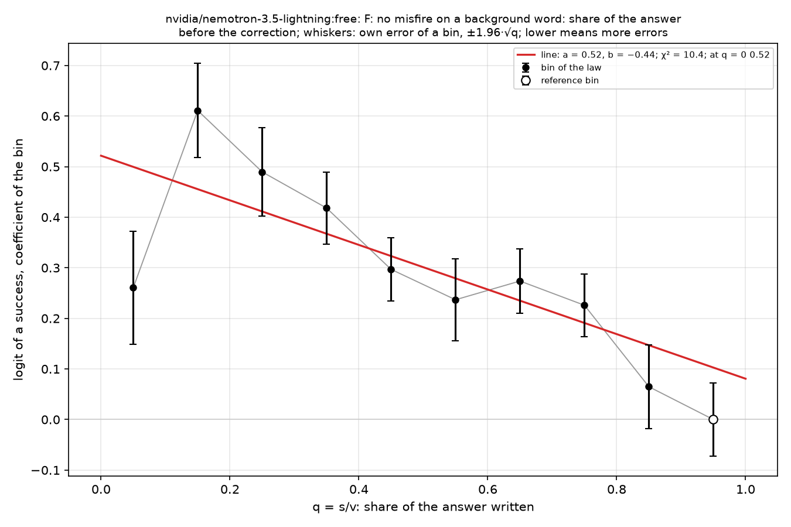

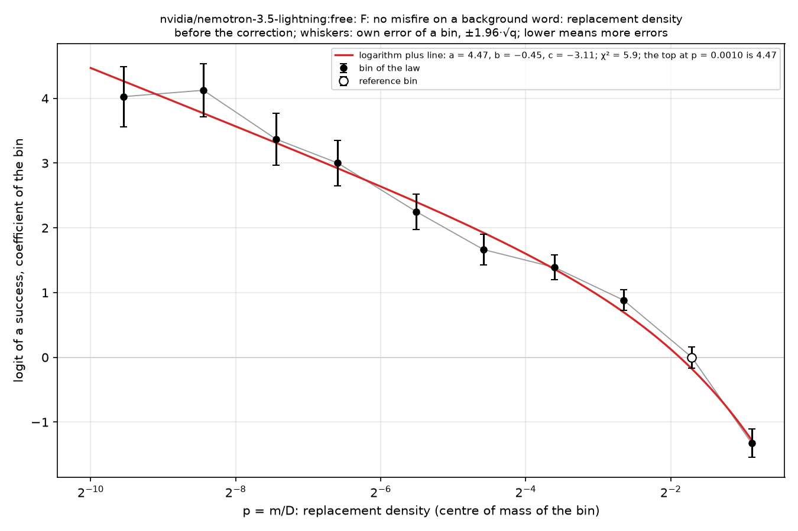

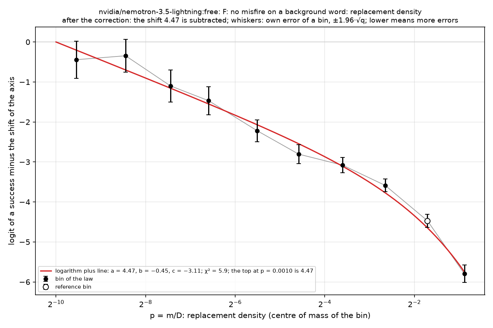

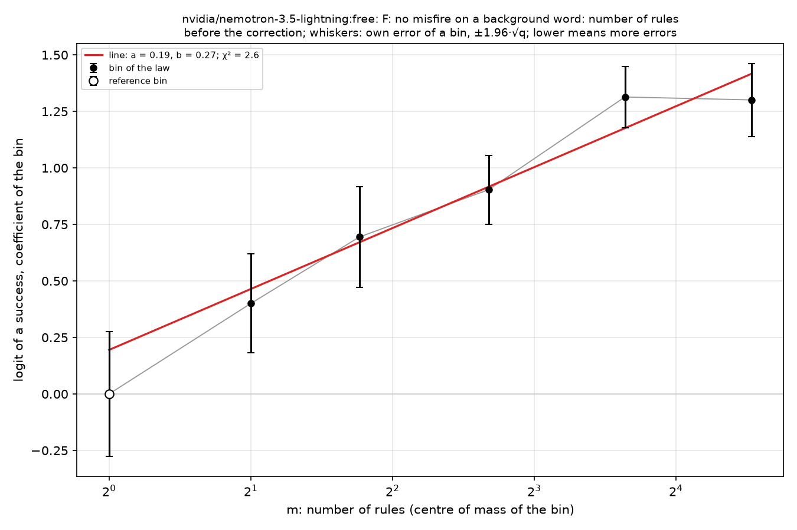

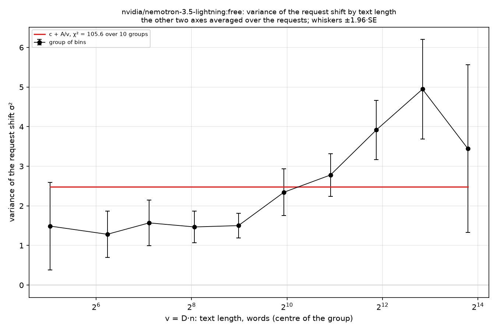

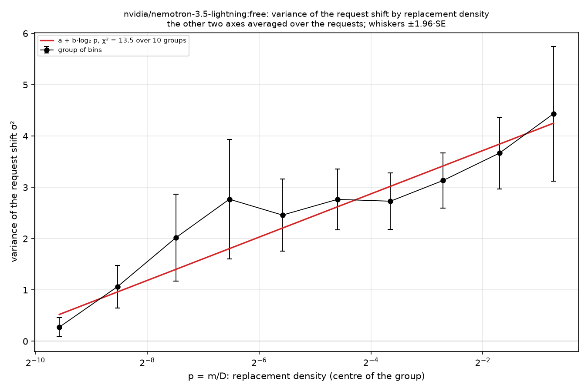

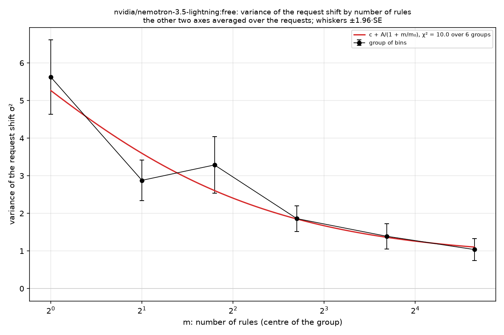
