# Passport of `nvidia/nemotron-3-ultra-550b-a55b:free`

Measurement `pilot_nemotron3_ultra_550b_a55b_v60`, 6,702 answered points. The method is described in `docs/05-passport-model.md` of the repository.

## The formula

`P_correct = P_sync · [π · H + (1 − π) · (1 − F)]`. The formula is the way to combine the three quantities: it has no law and no capacity of its own. `π = m/D` is the replacement density. The zero point of a capacity is a text of 20 words, the start of the answer, the density at the maximum of its law and one rule; every other axis of the capacity is set by its definition.

The capacities are taken at the level 0.5. At it the share of successes over all requests and the success of the median request reach one half at the same logit, zero, whatever the variance of the request shift: a capacity is the load at which the laws bring the logit of the median request to zero, and it does not depend on that variance.

## P_sync: the answer word stands against its reference word

Model VS-PM, request weights by the cube V × P × M. Fit: with the shift of a request; the variance of the request shift `σ² = 14.86`; 6,647 requests, 108,717,543 trials, 63,272,687 failures, 101 parameters; removed bins: vs_1_1, vs_1_2, vs_2_2, vs_3_1, vs_3_2, vs_3_3, vs_3_4, vs_5_1. The variance by the load turned bins against the median request of the data, so the quantity keeps one variance: the variance by the load turns bins against the median request: m_bin_3: passport -0.18, median request +0.90 ± 0.33; m_bin_4: passport -0.25, median request +1.58 ± 0.46; m_bin_5: passport -0.66, median request +1.90 ± 0.50; m_bin_6: passport -0.28, median request +2.37 ± 0.49; m_bin_7: passport -0.11, median request +3.75 ± 0.66; m_bin_8: passport -0.04, median request +3.83 ± 0.96; m_bin_9: passport -0.54, median request +4.23 ± 1.70.

The law of the grid: a length slice is a slanted hyperbola, `μ + (κ/2)·[(ℓ − ℓ*) + √((ℓ − ℓ*)² + ω²)]` over `ℓ = log₂ s`, with an own level `μ` in every slice and the other parameters shared, in the coding of the fit: `kappa = −3.204 ± 0.615`, `corner = 7.264 ± 0.965`, `omega = 3.609 ± 1.287`; `χ² = 76.9` over 82 cells; chosen by the smallest `QAIC` among 3 forms. The law of the plateau runs through the levels of the slices.

The law of the plateau is a slanted hyperbola, `μ + (κ/2)·[(log₂(v/20) − log₂(v/20)*) + √((log₂(v/20) − log₂(v/20)*)² + ω²)]`: `mu = 23.06 ± 2.94`, `kappa = −1.75 ± 0.71`, `corner = 10.65 ± 0.00`, `omega = 10.65 ± 0.00`; `χ² = 2.4` over 10 bins; on the bound of the search: corner, omega; chosen by the smallest `QAIC` among 3 forms.

The law of the density is a binary exponential, `μ − A·2^(γ·log₂(p/2⁻¹⁰))`: `mu = 16.78 ± 1.60`, `A = 3.95 ± 1.01`, `gamma = 0.26 ± 0.03`; `χ² = 10.9` over 11 bins; chosen by the smallest `QAIC` among 3 forms.

The law of the number of rules is a line, `a + b·log₂ m`: `a = 1.06 ± 0.53`, `b = 0.14 ± 0.07`; `χ² = 6.2` over 8 bins; chosen by the smallest `QAIC` among 3 forms.

The level `α = δ_VS + δ_P + δ_M = 40.91 ± 3.38` is the logit at the density going to zero and one rule, and that density is itself a continuation of the law.

| Capacity | q | By the law | By the bins |
|---|---|---|---|
| instruction capacity, rules | 0.5 | none: the law gives no root | at least 256, reserve left 39.84 |
| fatigue capacity, words | 0.5 | 84,432 (58,255–1.2·10⁵), continuation of the law | - |
| how many times full density multiplies the odds of an error | - | 1.3·10¹⁰ (2.5·10⁹–6.2·10¹⁰) | - |

The instruction capacity is the number of rules at which the law of the number of rules brings the logit to zero, and next to it the walk along the bins of that axis; by the law it is none when the fall of that law over its bins does not differ from zero. The fatigue capacity is the word at which the full law of the grid at the density going to zero and one rule reaches zero, on a text of the same length: by the curve of the law, as for `H`. Full density multiplies the odds of an error by `e^(−P̂(1))`, `P̂(1) = P(1) − δ_P` the change of the law of the density from the density going to zero to `p = 1`; a factor below one means that full density lowers the odds of an error. The interval is `e^(−P̂(1) ∓ h)`, `h` the half-width of `P̂(1)`.

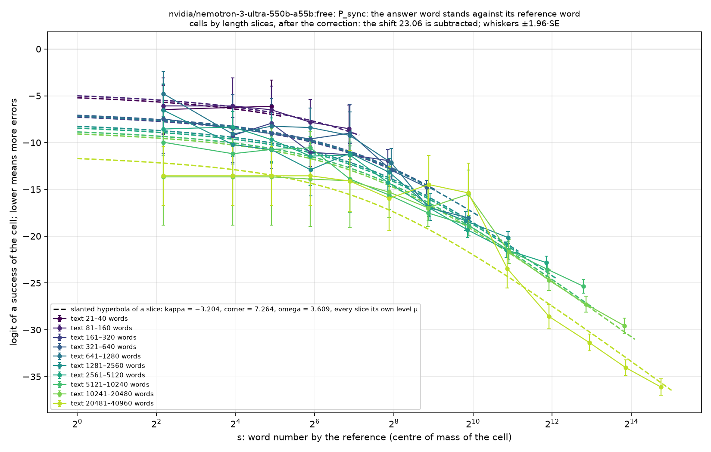

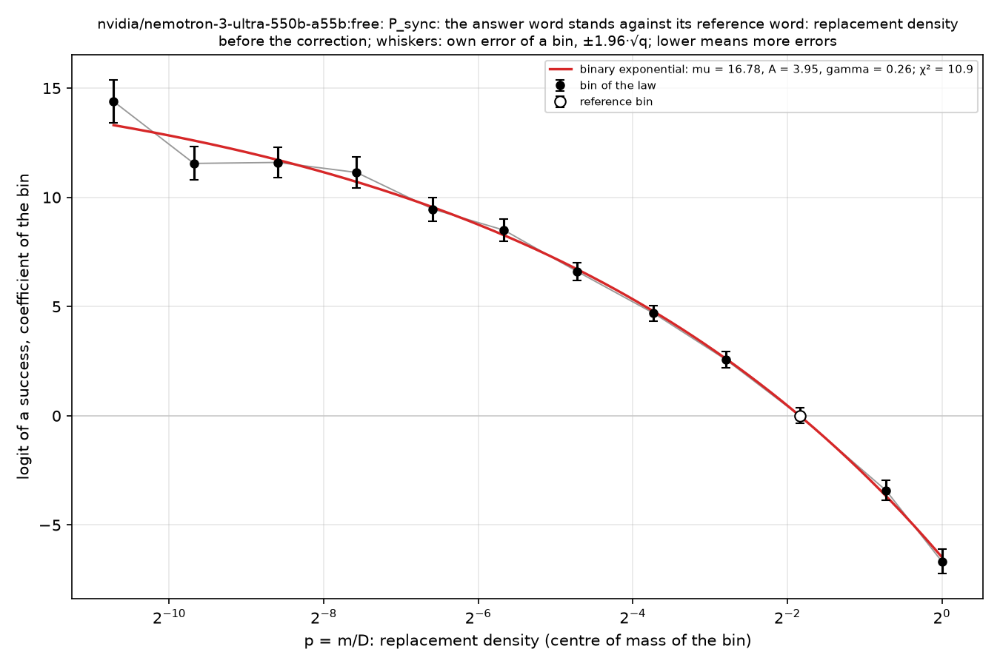

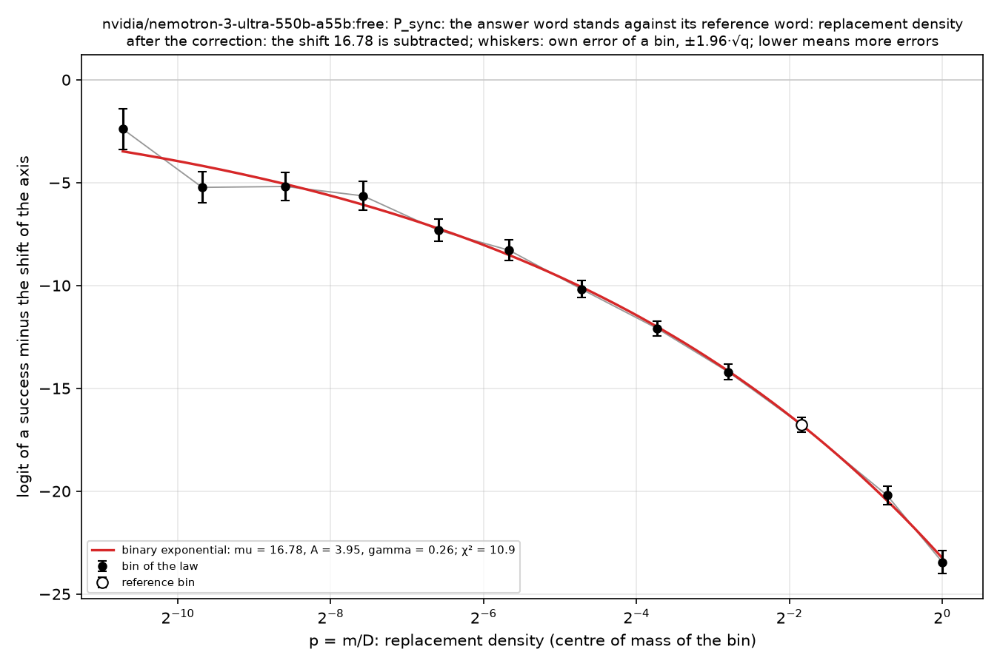

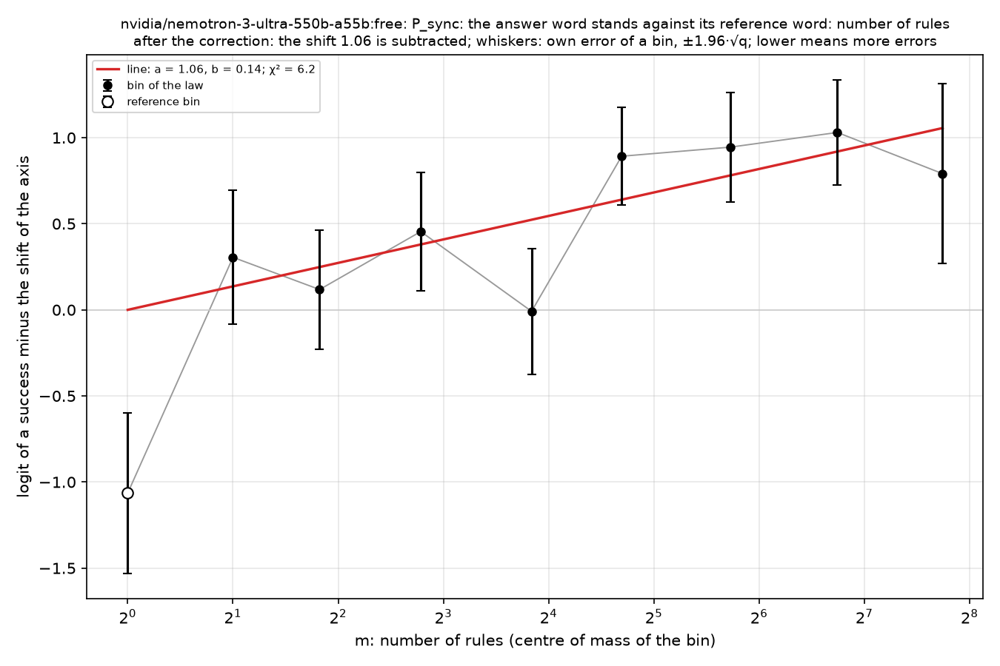

## H: a rule word on its place is replaced correctly

Model VS-PMR, request weights by the cube V × P × M. Fit: GLMM with heterogeneous random-intercept variance, that is with the shift of a request whose variance depends on the load; the variance of the request shift `σ² = 3.42`; 6,632 requests, 3,583,234 trials, 955,833 failures, 103 parameters; removed bins: vs_1_1, vs_1_2, vs_2_1, vs_2_2, vs_3_1, vs_3_2, vs_3_3, vs_3_4, vs_4_1, vs_4_2, vs_5_1, vs_5_2, vs_6_2, vs_12_2.

The variance of the shift depends on the load: `ln σ_j = z_j·γ`, 26 parameters more than one variance, `2·Δ ln L = 974.3`. `σ²` above is the mean over the requests. A group is taken with the other two axes averaged over the requests.

| Axis | Centre of the group | Share of the requests | σ² |
|---|---|---|---|
| text length, words | 171.5 | 0.08 | 2.56 ± 1.51 |
| text length, words | 534.8 | 0.06 | 1.35 ± 0.47 |
| text length, words | 1027 | 0.10 | 2.09 ± 0.54 |
| text length, words | 2038 | 0.11 | 1.83 ± 0.42 |
| text length, words | 4076 | 0.18 | 2.13 ± 0.32 |
| text length, words | 7779 | 0.20 | 2.68 ± 0.55 |
| text length, words | 1.53e+04 | 0.17 | 2.47 ± 0.60 |
| text length, words | 3.084e+04 | 0.10 | 1.68 ± 0.42 |
| density | 0.0006288 | 0.03 | 2.40 ± 1.81 |
| density | 0.001273 | 0.04 | 1.60 ± 0.84 |
| density | 0.002666 | 0.06 | 2.91 ± 1.39 |
| density | 0.005233 | 0.06 | 1.51 ± 0.69 |
| density | 0.01046 | 0.08 | 1.08 ± 0.32 |
| density | 0.02044 | 0.07 | 1.47 ± 0.79 |
| density | 0.04046 | 0.09 | 1.35 ± 0.40 |
| density | 0.08032 | 0.10 | 1.38 ± 0.34 |
| density | 0.1538 | 0.11 | 1.66 ± 0.36 |
| density | 0.289 | 0.12 | 2.14 ± 0.44 |
| density | 0.6143 | 0.12 | 4.87 ± 1.17 |
| density | 1 | 0.13 | 5.44 ± 1.37 |
| number of rules | 1 | 0.13 | 4.98 ± 1.83 |
| number of rules | 2 | 0.11 | 4.16 ± 1.25 |
| number of rules | 3.52 | 0.14 | 4.17 ± 0.96 |
| number of rules | 6.768 | 0.13 | 4.69 ± 0.98 |
| number of rules | 13.51 | 0.10 | 2.82 ± 0.62 |
| number of rules | 25.64 | 0.18 | 2.25 ± 0.63 |
| number of rules | 51.66 | 0.10 | 0.70 ± 0.22 |
| number of rules | 101.9 | 0.08 | 0.23 ± 0.07 |
| number of rules | 217 | 0.04 | 0.13 ± 0.04 |

The approximations through the groups, by the residuals in `ln σ²`, serve the eye.

| Axis | Approximation | Parameters | χ² |
|---|---|---|---|
| text length, words | `a + b·log₂ v` | `a = 1.43`, `b = 0.055` | 17.1 over 8 groups |
| density | `a + b·log₂ p` | `a = 2.77`, `b = 0.171` | 108.4 over 12 groups |
| number of rules | `c + A/(1 + m/m₀)` | `c = 0.00`, `A = 7.45`, `m₀ = 5.89` | 49.0 over 9 groups |

The law of the grid: a length slice is a two-asymptote hyperbola, `[(κ·ℓ + λ) + μ − √((κ·ℓ + λ − μ)² + κ²·ω²)]/2` over `ℓ = log₂ s`, with an own level `μ` in every slice and the other parameters shared, in the coding of the fit: `kappa = −1.281 ± 0.053`, `lambda = 21.834 ± 0.736`, `omega = 2.107 ± 0.411`; `χ² = 68.8` over 76 cells; chosen by the smallest `QAIC` among 3 forms. The law of the levels runs through the levels of the slices.

The law of the levels of the slices is a binary exponential, `μ − A·2^(γ·log₂(v/20))`: `mu = 13.97 ± 0.72`, `A = 0.00 ± 0.00`, `gamma = 1.29 ± 0.41`; `χ² = 7.7` over 8 bins; chosen by the smallest `QAIC` among 3 forms.

The law of the density is a two-slope hyperbola, `μ + β·(log₂(p/2⁻¹⁰) − log₂(p/2⁻¹⁰)*) + (κ/2)·[(log₂(p/2⁻¹⁰) − log₂(p/2⁻¹⁰)*) + √((log₂(p/2⁻¹⁰) − log₂(p/2⁻¹⁰)*)² + ω²)]`: `mu = 10.44 ± 3.87`, `kappa = −5.06 ± 0.39`, `corner = 10.00 ± 0.00`, `omega = 5.05 ± 1.33`, `beta = 0.85 ± 0.25`; `χ² = 7.3` over 11 bins; on the bound of the search: corner; chosen by the smallest `QAIC` among 4 forms.

The law of the number of rules is a line, `a + b·log₂ m`: `a = −0.30 ± 0.43`, `b = −0.57 ± 0.04`; `χ² = 7.7` over 8 bins; chosen by the smallest `QAIC` among 3 forms.

The law of the rule number is a line, `a + b·log₂ r`: `a = 0.29 ± 0.20`, `b = −0.23 ± 0.02`; `χ² = 5.6` over 8 bins; chosen by the smallest `QAIC` among 3 forms.

The level `α = μ₀ + μ_P + λ_M + λ_R = 12.81 ± 0.72`. The loss of the density at `p = 1` is 1.20 logits.

| Capacity | q | By the law | By the bins |
|---|---|---|---|
| instruction capacity, rules | 0.5 | 17.0 (15.8–18.1) | 16.4 |
| fatigue capacity, words | 0.5 | 39,459 (35,258–44,161) | - |
| how many times full density multiplies the odds of an error | - | 3.3 (2.1–5.2) | - |

Full density multiplies the odds of an error by `e^(−P̂(1))`, `P̂(1) = P(1) − μ_P` the change of the law of the density from its zero point, `p = 2⁻¹⁰` for the two-slope hyperbola, to `p = 1`; a factor below one means that full density lowers the odds of an error. The interval is `e^(−P̂(1) ∓ h)`, `h` the half-width of `P̂(1)`.

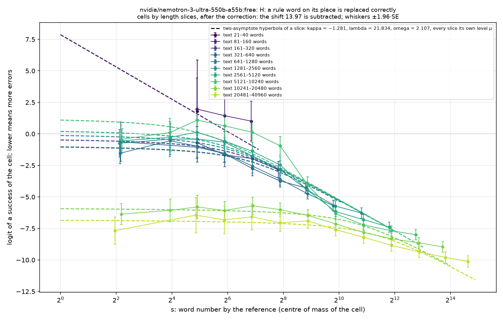

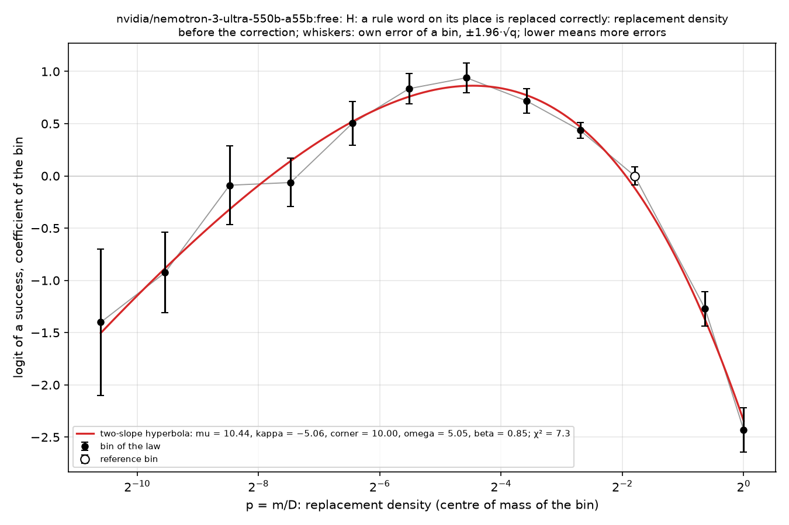

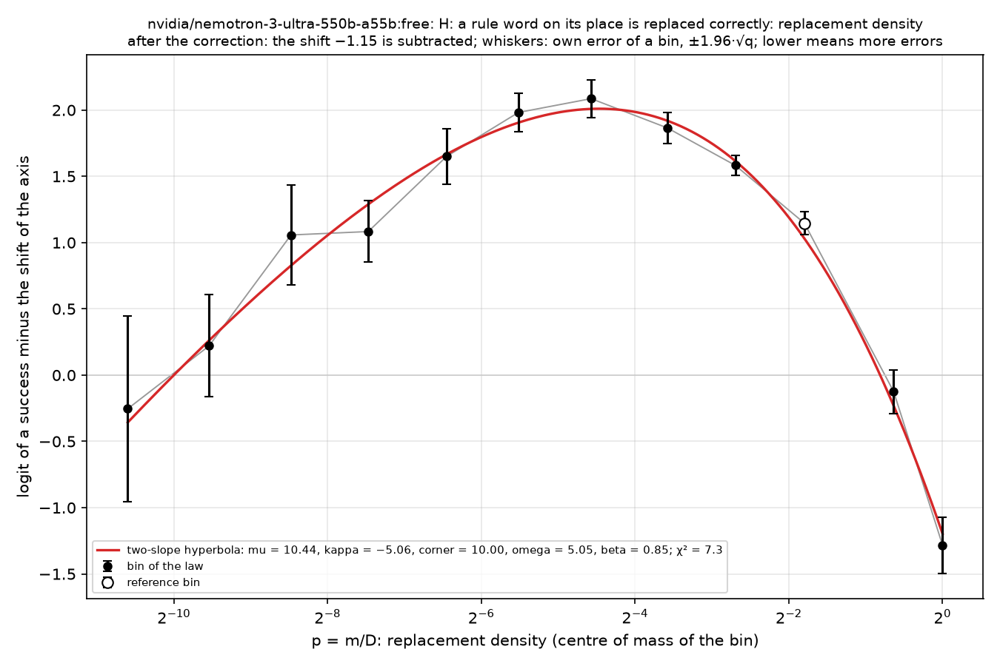

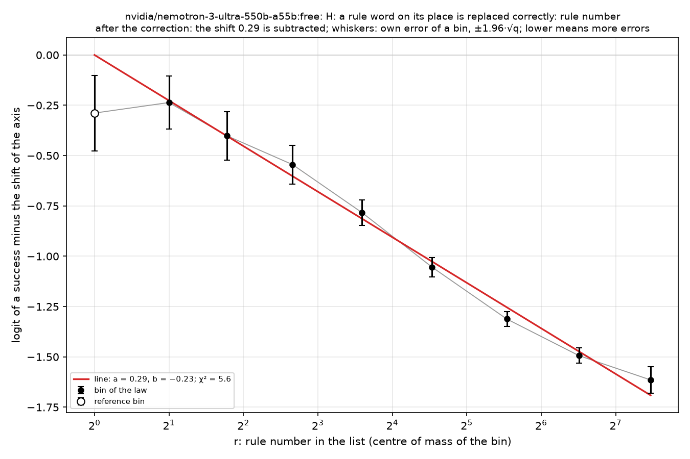

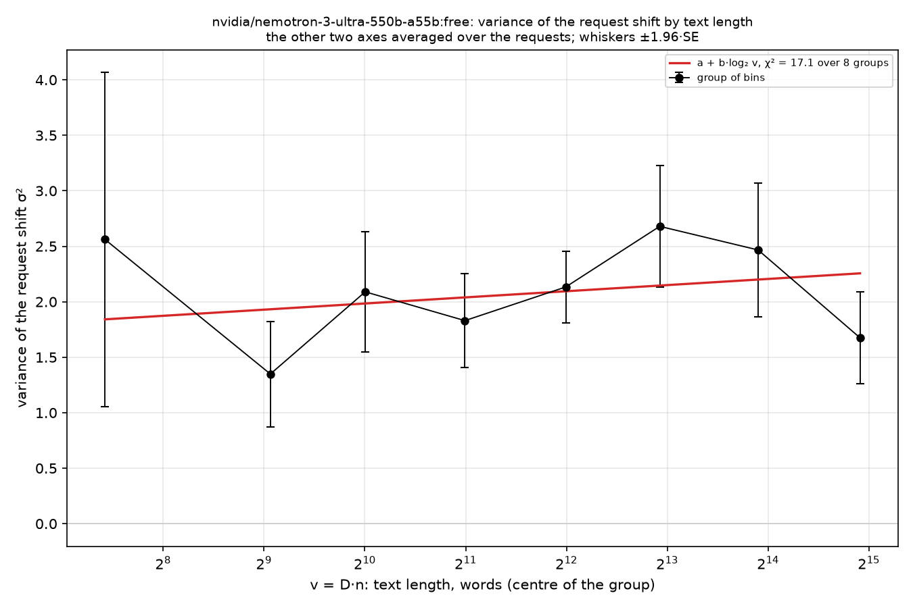

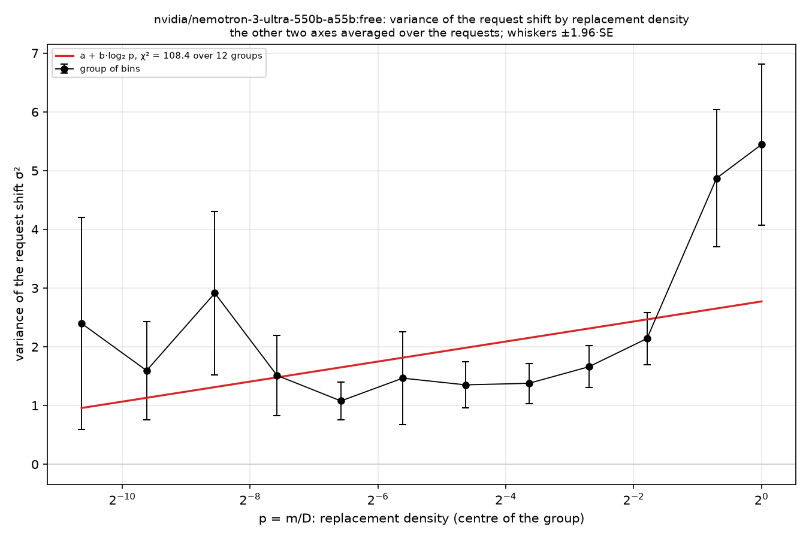

## F: a misfire on a background word on its place

Model V-(s/v)-PM, request weights by the cube V × P × M. Fit: GLMM with heterogeneous random-intercept variance, that is with the shift of a request whose variance depends on the load; the variance of the request shift `σ² = 3.95`; 5,762 requests, 41,854,373 trials, 15,265 failures, 36 parameters; removed bins: v_bin_1, v_bin_2, v_bin_3.

The variance of the shift depends on the load: `ln σ_j = z_j·γ`, 22 parameters more than one variance, `2·Δ ln L = 315.4`. `σ²` above is the mean over the requests. A group is taken with the other two axes averaged over the requests.

| Axis | Centre of the group | Share of the requests | σ² |
|---|---|---|---|
| text length, words | 619.1 | 0.16 | 3.22 ± 1.08 |
| text length, words | 2026 | 0.11 | 3.47 ± 1.01 |
| text length, words | 4097 | 0.19 | 3.78 ± 0.72 |
| text length, words | 7751 | 0.22 | 3.37 ± 0.56 |
| text length, words | 1.53e+04 | 0.20 | 2.00 ± 0.41 |
| text length, words | 3.085e+04 | 0.12 | 2.30 ± 0.72 |
| density | 0.0009696 | 0.08 | 5.71 ± 2.91 |
| density | 0.002664 | 0.06 | 5.94 ± 3.49 |
| density | 0.005233 | 0.07 | 2.98 ± 1.21 |
| density | 0.01046 | 0.10 | 4.49 ± 1.67 |
| density | 0.02044 | 0.08 | 2.46 ± 0.77 |
| density | 0.04046 | 0.11 | 1.57 ± 0.48 |
| density | 0.08032 | 0.11 | 1.68 ± 0.41 |
| density | 0.1539 | 0.12 | 2.53 ± 0.57 |
| density | 0.2892 | 0.14 | 2.85 ± 0.62 |
| density | 0.6136 | 0.14 | 3.74 ± 0.98 |
| number of rules | 1 | 0.15 | 3.99 ± 1.09 |
| number of rules | 2 | 0.12 | 5.12 ± 1.81 |
| number of rules | 3.466 | 0.14 | 5.98 ± 2.12 |
| number of rules | 6.673 | 0.13 | 2.63 ± 0.66 |
| number of rules | 13.37 | 0.10 | 3.50 ± 0.88 |
| number of rules | 24.86 | 0.14 | 2.25 ± 0.52 |
| number of rules | 50.68 | 0.09 | 2.17 ± 0.64 |
| number of rules | 101.4 | 0.08 | 1.15 ± 0.33 |
| number of rules | 216.1 | 0.04 | 0.47 ± 0.30 |

The approximations through the groups, by the residuals in `ln σ²`, serve the eye.

| Axis | Approximation | Parameters | χ² |
|---|---|---|---|
| text length, words | `c + A/(1 + v/v₀)` | `c = 0.81`, `A = 3.26`, `v₀ = 16848.34` | 9.9 over 6 groups |
| density | `a + b·log₂ p` | `a = 2.44`, `b = −0.066` | 54.0 over 10 groups |
| number of rules | `c + A/(1 + m/m₀)` | `c = 0.00`, `A = 4.37`, `m₀ = 34.84` | 17.6 over 9 groups |

The laws run through the bins without the poorly determined ones; a bin weighs `1/(σᵢ² + τ²)`, its own variance and the scatter of the bins around the law, and the errors are carried by the full covariance of the bins.

The law of the length is a line, `a + b·log₂(v/20)`: `a = 12.53 ± 0.82`, `b = −0.61 ± 0.10`; `χ² = 1.1` over 8 bins; chosen by the smallest `QAIC` among 3 forms.

The law of the share of the answer is a line, `a + b·q`: `a = 1.65 ± 0.18`, `b = −1.92 ± 0.24`; `χ² = 8.7` over 9 bins; chosen by the smallest `QAIC` among 2 forms. A fall of 1.92 over the whole answer.

The law of the density is a logarithm plus a line, `a + b·log₂(p/2⁻¹⁰) + c·0.0009765625·2^(log₂(p/2⁻¹⁰))`: `a = 5.91 ± 0.72`, `b = −0.59 ± 0.11`, `c = −3.92 ± 1.04`; `χ² = 3.7` over 10 bins; chosen by the smallest `QAIC` among 4 forms.

The law of the number of rules is a line, `a + b·log₂ m`: `a = 0.86 ± 0.54`, `b = −0.42 ± 0.06`; `χ² = 5.9` over 8 bins; chosen by the smallest `QAIC` among 3 forms.

The level `α_F = V(20) + q(0) + δ_P + M(1) = 20.94 ± 1.19`, where `δ_P` is the maximum of the law of the density, at `p = 0.0010`; `V(20)` = 12.53 ± 0.82, `q(0)` = 1.65 ± 0.18, `δ_P` = 5.90 ± 0.72, `M(1)` = 0.86 ± 0.54. The edge of the measured area: 256 rules and 40,960 words.

| Capacity | q | By the law | By the bins |
|---|---|---|---|
| instruction capacity, rules | 0.5 | 7.7·10¹⁴ (2.3·10¹²–2.6·10¹⁷), continuation of the law | at least 256, reserve left 17.85 |
| fatigue capacity, words | 0.5 | 4.6·10¹⁰ (4.2·10⁹–5.0·10¹¹), continuation of the law | - |
| how many times full density multiplies the odds of an error | - | 17,479 (6,907–44,234), conditional: a continuation of the law of the density | - |

The instruction capacity is the number of rules at the zero point. The fatigue capacity is the number of the last word of a text of the same length at the zero point. Full density multiplies the odds of a misfire by `e^(−P̂(1))`, `P̂(1) = P(1) − P(p → 0)`; a factor below one would mean that full density lowers them. It is a conditional quantity: a text has no background words at `p = 1`, so it always continues the law of the density, and it allows comparing the effect of the density on `P_sync`, `H` and `F`.

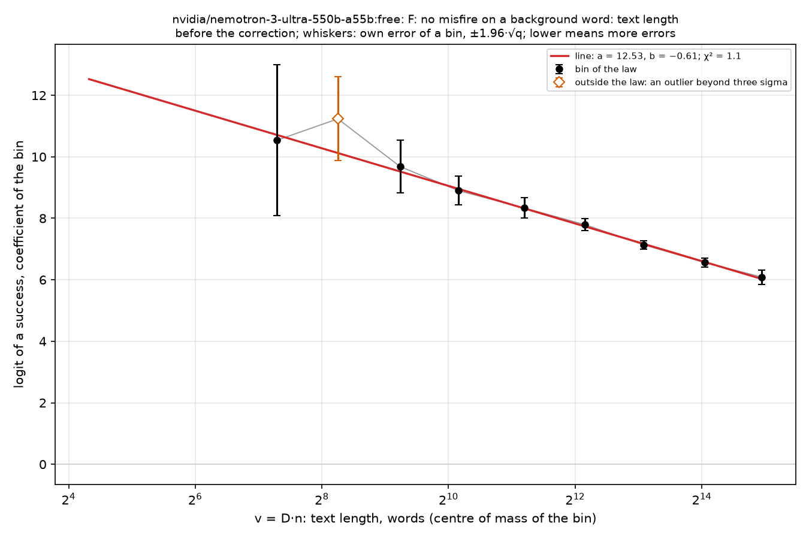

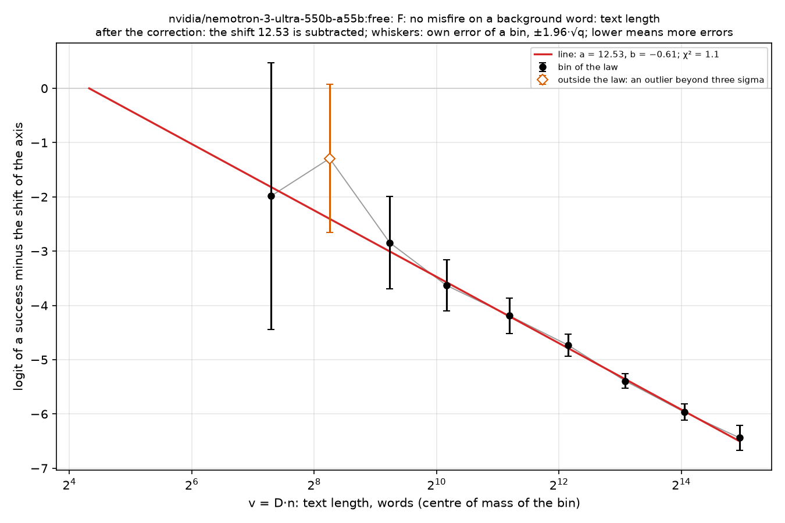

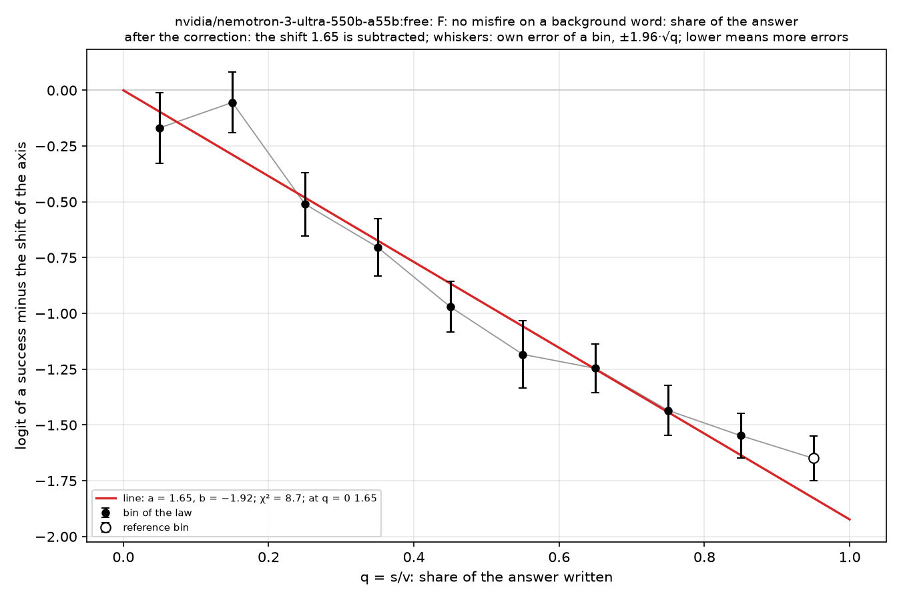

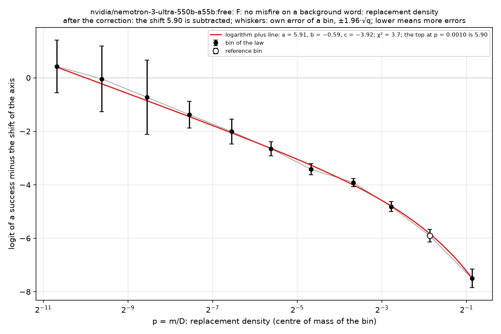

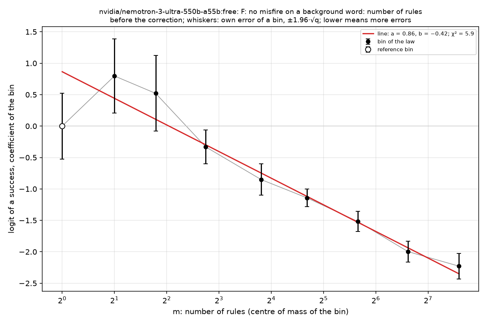

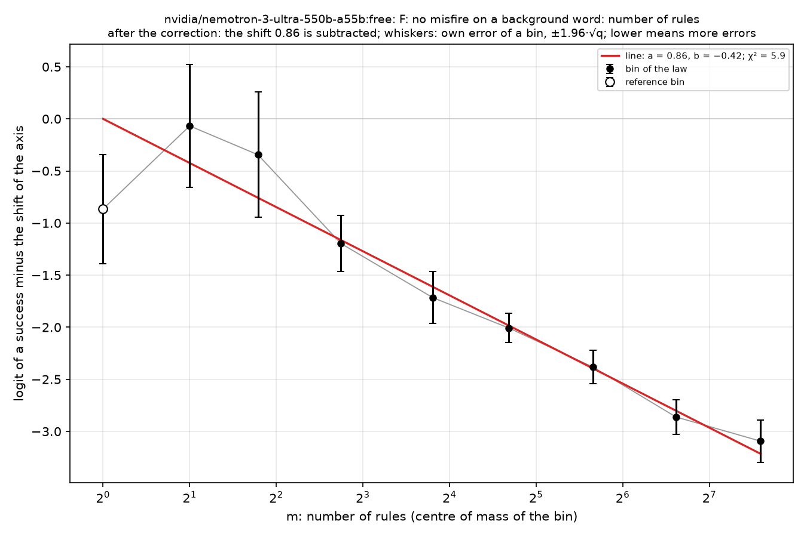

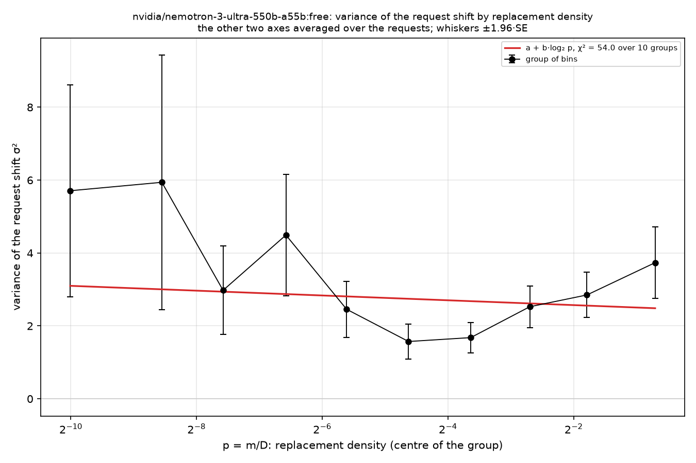

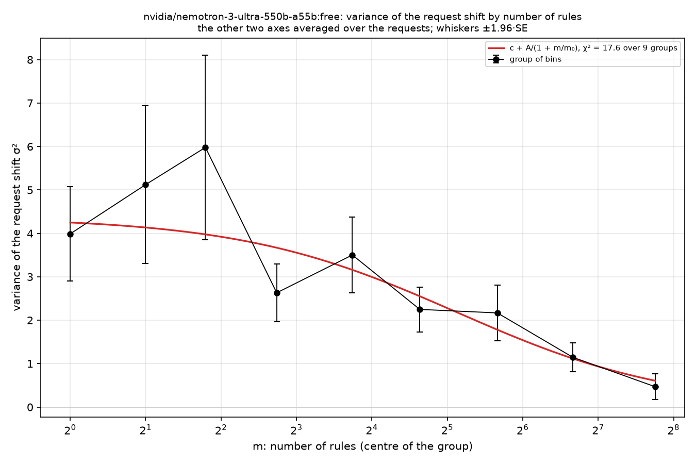
